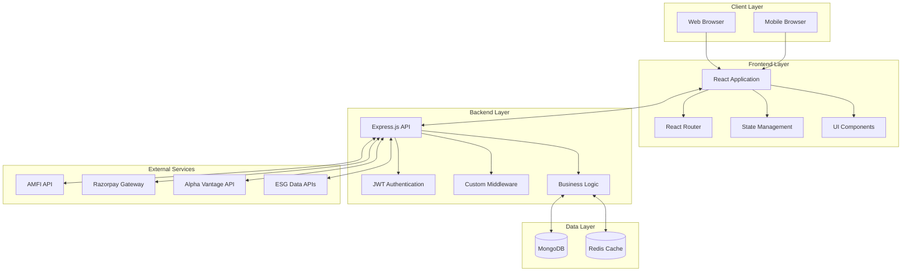

# 🌱 GreenVue - Sustainable Investment Platform

<div align="center">
  
  
  
  
  
</div>

<div align="center">
  <h3>🚀 Empowering Sustainable Investment Decisions Through Technology</h3>
  <p>A comprehensive ESG investment platform that combines AI-powered recommendations, real-time market data, and environmental impact tracking to make sustainable investing accessible to everyone.</p>
</div>

---

##  Features

###  **AI-Powered Investment Assistant**
- Personalized fund recommendations based on risk assessment
- Goal-based investment planning with timeline optimization
- Portfolio rebalancing suggestions with ESG score integration
- Interactive chat interface for investment queries

###  **Real-Time Market Analytics**
- Live NAV prices from AMFI API integration
- Dynamic ESG fund data with performance tracking
- Real-time stock price monitoring for major ESG stocks
- Portfolio value updates with automatic calculation

###  **Environmental Impact Tracking**
- Carbon footprint calculation based on investment portfolio
- ESG score visualization and fund comparison
- Impact metrics showing environmental contribution
- Sustainability goal tracking and progress monitoring

###  **Secure Investment Management**
- Integrated Razorpay payment gateway for seamless transactions
- Portfolio management with detailed transaction history
- Fund comparison tools with comprehensive analytics
- Investment tracking with profit/loss calculations

###  **Modern User Experience**
- Responsive design optimized for all devices
- Intuitive dashboard with data visualizations
- Real-time notifications and market updates
- Clean, modern UI built with Tailwind CSS

##  Technology Stack

### **Frontend**
- **React 18.2** - Modern UI library with hooks
- **Vite 4.4** - Lightning-fast build tool and dev server
- **Tailwind CSS 3.4** - Utility-first CSS framework
- **Framer Motion** - Smooth animations and transitions
- **React Router** - Client-side routing with nested routes
- **Lucide React** - Beautiful icon library

### **Backend**
- **Node.js 18.x** - JavaScript runtime environment
- **Express.js** - Minimal web application framework
- **MongoDB 6.0** - Document-based NoSQL database
- **Mongoose** - MongoDB object modeling for Node.js
- **JWT** - Secure authentication with JSON Web Tokens

### **External APIs**
- **AMFI API** - Real-time mutual fund NAV data
- **Razorpay** - Payment processing and transaction management
- **Alpha Vantage** - Stock market data and analytics
- **Custom ESG API** - Environmental, Social, Governance scoring

### **Development Tools**
- **ESLint** - Code quality and consistency
- **Prettier** - Automated code formatting
- **Git** - Version control system

##  Quick Start

### Prerequisites
```bash
Node.js 18.x or higher
MongoDB 6.0 or higher
Git
```

### Installation

1. **Clone the repository**
```bash
git clone https://github.com/khushi7983/GreenVue.git
cd GreenVue
```

2. **Install dependencies**
```bash
# Install frontend dependencies
npm install

# Install backend dependencies
cd server
npm install
cd ..
```

3. **Environment Setup**

Create `.env` file in the root directory:
Create `.env` file in the server directory:

4. **Start the application**
```bash
# Start backend server (in server directory)
cd server
npm start

# Start frontend development server (in root directory)
cd ..
npm run dev
```

5. **Access the application**
```
Frontend: http://localhost:5173
Backend: http://localhost:5000
```

##  System Architecture




### **Component Architecture Diagram**

```
┌─────────────────────────────────────────────────────────────┐
│                    FRONTEND ARCHITECTURE                     │
├─────────────────────────────────────────────────────────────┤
│  App.jsx (Main Router)                                      │
│  ├── Navbar (Global Navigation)                             │
│  ├── AuthProvider (Authentication Context)                  │
│  └── Routes                                                 │
│      ├── LandingPage                                        │
│      ├── Auth (Login/Signup)                                │
│      └── Features Layout (Protected Routes)                 │
│          ├── Dashboard                                      │
│          ├── AI Assistant                                   │
│          ├── Green Funds                                    │
│          ├── Fund Comparison                                │
│          ├── Impact Calculator                              │
│          ├── Portfolio                                      │
│          └── Transactions                                   │
└─────────────────────────────────────────────────────────────┘

┌─────────────────────────────────────────────────────────────┐
│                    BACKEND ARCHITECTURE                     │
├─────────────────────────────────────────────────────────────┤
│  server/index.js (Express App)                              │
│  ├── Middleware Stack                                       │
│  │   ├── CORS                                               │
│  │   ├── Body Parser                                        │
│  │   ├── Rate Limiting                                      │
│  │   └── Authentication                                     │
│  ├── Route Handlers                                         │
│  │   ├── /api/auth (User Management)                        │
│  │   ├── /api/funds (Fund Operations)                       │
│  │   ├── /api/portfolio (Portfolio Management)              │
│  │   ├── /api/transactions (Payment Processing)             │
│  │   └── /api/impact (Environmental Tracking)               │
│  └── External API Integration                               │
│      ├── AMFI API (NAV Data)                                │
│      ├── Razorpay (Payments)                                │
│      └── Alpha Vantage (Stock Data)                         │
└─────────────────────────────────────────────────────────────┘
```

### **Data Flow Architecture**

```
USER INTERACTION FLOW:
┌─────────────┐    ┌─────────────┐    ┌─────────────┐    ┌─────────────┐
│   Browser   │───▶│   React     │───▶│   API       │───▶│  Database   │
│             │    │ Components  │    │ Controllers │    │   MongoDB   │
└─────────────┘    └─────────────┘    └─────────────┘    └─────────────┘
       ▲                  ▲                  ▲                  │
       │                  │                  │                  │
       │            ┌─────────────┐    ┌─────────────┐          │
       │            │   State     │    │  External   │          │
       └────────────│ Management  │◀───│    APIs     │◀─────────┘
                    └─────────────┘    └─────────────┘

REAL-TIME DATA FLOW:
External APIs ──┐
                ├──▶ Backend Cache ──▶ API Response ──▶ Frontend State
Database ───────┘                                       │
                                                        ▼
                                                   UI Updates
```


```
┌─────────────────────────────────────────────────────────────┐
│                    SECURITY LAYERS                          │
├─────────────────────────────────────────────────────────────┤
│  Frontend Security                                          │
│  ├── Input Validation (Client-side)                        │
│  ├── JWT Token Management                                   │
│  ├── Protected Routes                                       │
│  └── HTTPS Enforcement                                      │
│                                                             │
│  API Security                                               │
│  ├── JWT Authentication Middleware                          │
│  ├── Request Rate Limiting                                  │
│  ├── Input Sanitization                                     │
│  ├── CORS Configuration                                     │
│  └── API Key Management                                     │
│                                                             │
│  Database Security                                          │
│  ├── MongoDB Connection Security                            │
│  ├── Data Encryption at Rest                               │
│  ├── Schema Validation                                      │
│  └── Access Control                                         │
│                                                             │
│  Payment Security                                           │
│  ├── Razorpay Signature Verification                       │
│  ├── PCI DSS Compliance                                     │
│  ├── Transaction Encryption                                 │
│  └── Audit Trail Logging                                   │
└─────────────────────────────────────────────────────────────┘
```

### **Microservices Architecture (Scalable Design)**

```
┌─────────────────────────────────────────────────────────────┐
│                  MICROSERVICES BREAKDOWN                    │
├─────────────────────────────────────────────────────────────┤
│  API Gateway (Express.js)                                   │
│  ├── Authentication Service                                 │
│  │   ├── User Registration/Login                           │
│  │   ├── JWT Token Management                              │
│  │   └── Session Handling                                  │
│  │                                                         │
│  ├── Fund Management Service                                │
│  │   ├── Fund Search & Discovery                           │
│  │   ├── NAV Price Integration                             │
│  │   ├── Fund Comparison Logic                             │
│  │   └── ESG Rating Management                             │
│  │                                                         │
│  ├── Portfolio Service                                      │
│  │   ├── Investment Tracking                               │
│  │   ├── Performance Calculation                           │
│  │   ├── Holdings Management                               │
│  │   └── Portfolio Analytics                               │
│  │                                                         │
│  ├── Transaction Service                                    │
│  │   ├── Payment Processing                                │
│  │   ├── Order Management                                  │
│  │   ├── Transaction History                               │
│  │   └── Razorpay Integration                              │
│  │                                                         │
│  ├── AI/ML Service                                          │
│  │   ├── Investment Recommendations                        │
│  │   ├── Risk Assessment                                   │
│  │   ├── Portfolio Optimization                            │
│  │   └── Predictive Analytics                              │
│  │                                                         │
│  └── Impact Tracking Service                                │
│      ├── Environmental Impact Calculation                  │
│      ├── ESG Score Aggregation                             │
│      ├── Sustainability Metrics                            │
│      └── Carbon Footprint Analysis                         │
└─────────────────────────────────────────────────────────────┘
```

## 📱 Application Structure

```
GreenVue/
├── src/                          # Frontend React application
│   ├── components/              # Reusable UI components
│   │   ├── auth/               # Authentication components
│   │   │   ├── Login.jsx       # User login form
│   │   │   ├── Signup.jsx      # User registration form
│   │   │   └── ProtectedRoute.jsx # Route protection wrapper
│   │   ├── AIInvestmentAssistant.jsx # AI-powered investment advice
│   │   ├── GreenFundSearch.jsx     # ESG fund search interface
│   │   ├── ImpactCalculator.jsx    # Environmental impact calculator
│   │   ├── FundComparison.jsx      # Fund comparison tool
│   │   ├── PortfolioPage.jsx       # Portfolio management
│   │   └── TransactionPage.jsx     # Investment transactions
│   ├── pages/                  # Page components
│   │   └── features/           # Feature-specific pages
│   │       ├── AIAssistantPage.jsx
│   │       ├── GreenFundsPage.jsx
│   │       ├── FundComparisonPage.jsx
│   │       └── ImpactCalculatorPage.jsx
│   ├── layouts/                # Layout wrapper components
│   │   └── FeaturesLayout.jsx  # Main features layout with sidebar
│   ├── services/               # API service layer
│   │   ├── apiClient.js        # Axios configuration
│   │   ├── authService.js      # Authentication API calls
│   │   ├── fundService.js      # Fund-related API calls
│   │   └── aiService.js        # AI recommendation services
│   ├── utils/                  # Utility functions
│   │   ├── constants.js        # Application constants
│   │   ├── helpers.js          # Helper functions
│   │   └── razorpay.js         # Payment integration
│   └── styles/                 # Component-specific styles
├── server/                     # Backend Node.js application
│   ├── controllers/            # Business logic controllers
│   │   ├── authController.js   # Authentication logic
│   │   ├── fundController.js   # Fund management logic
│   │   ├── transactionController.js # Transaction processing
│   │   └── portfolioController.js   # Portfolio management
│   ├── models/                 # MongoDB data models
│   │   ├── User.js             # User schema and methods
│   │   ├── Transaction.js      # Transaction schema
│   │   ├── ESGFund.js          # Fund data schema
│   │   └── Portfolio.js        # Portfolio schema
│   ├── routes/                 # API route definitions
│   │   ├── authRoutes.js       # Authentication endpoints
│   │   ├── fundRoutes.js       # Fund-related endpoints
│   │   ├── paymentRoutes.js    # Payment processing endpoints
│   │   └── portfolioRoutes.js  # Portfolio management endpoints
│   ├── middleware/             # Custom middleware
│   │   ├── auth.js             # JWT authentication middleware
│   │   ├── validation.js       # Request validation middleware
│   │   └── rateLimiter.js      # Rate limiting middleware
│   ├── config/                 # Configuration files
│   │   ├── database.js         # MongoDB connection config
│   │   ├── jwt.js              # JWT configuration
│   │   └── apiKeys.js          # External API keys management
│   └── utils/                  # Backend utility functions
│       ├── encryption.js       # Data encryption utilities
│       ├── apiHelpers.js       # API helper functions
│       └── validators.js       # Input validation functions
└── public/                     # Static assets
    ├── images/                 # Image assets
    ├── icons/                  # Icon files
    └── favicon.ico            # Application favicon
```

## 🔧 API Documentation

### Authentication Endpoints
```
POST /api/auth/register     # User registration
POST /api/auth/login        # User login
POST /api/auth/refresh      # Refresh JWT token
POST /api/auth/logout       # User logout
```

### Fund Management
```
GET  /api/funds/search      # Search ESG funds
GET  /api/funds/nav/:code   # Get NAV price by scheme code
GET  /api/funds/trending    # Get trending ESG funds
POST /api/funds/compare     # Compare multiple funds
```

### Portfolio Operations
```
GET  /api/portfolio         # Get user portfolio
POST /api/portfolio/invest  # Make new investment
GET  /api/portfolio/history # Transaction history
PUT  /api/portfolio/update  # Update portfolio settings
```

### Impact Tracking
```
GET  /api/impact/calculate  # Calculate environmental impact
GET  /api/impact/metrics    # Get impact metrics
POST /api/impact/goals      # Set sustainability goals
```

## 🎯 Key Features Demo

### 1. AI Investment Assistant
```javascript
// Example API call for AI recommendations
const getRecommendations = async (riskProfile) => {
  const response = await fetch('/api/ai/recommend', {
    method: 'POST',
    headers: { 'Content-Type': 'application/json' },
    body: JSON.stringify({ 
      riskProfile, 
      investmentAmount: 10000,
      goals: ['environmental_impact', 'steady_returns']
    })
  });
  return response.json();
};
```

### 2. Real-Time NAV Integration
```javascript
// Fetch live NAV prices
const fetchNAVPrice = async (schemeCode) => {
  const response = await fetch(`/api/funds/nav/${schemeCode}`);
  const data = await response.json();
  return data.nav;
};
```

### 3. Impact Calculation
```javascript
// Calculate environmental impact
const calculateImpact = (portfolio) => {
  const totalInvestment = portfolio.reduce((sum, fund) => sum + fund.amount, 0);
  const carbonReduction = totalInvestment * 0.05; // 5% carbon reduction per ₹1000
  return { carbonReduction, treesEquivalent: carbonReduction * 0.02 };
};
```

##  Testing

```bash
# Run frontend tests
npm test

# Run backend tests
cd server
npm test

# Run integration tests
npm run test:integration

# Generate test coverage report
npm run test:coverage
```

##  Security Features

- **JWT Authentication** with access and refresh tokens
- **Password Hashing** using bcrypt with salt rounds
- **Input Validation** using Joi schema validation
- **Rate Limiting** for API endpoints
- **CORS Protection** for cross-origin requests
- **Payment Security** with Razorpay signature verification

## 📈 Performance Optimizations

- **Code Splitting** with React.lazy() for route-based chunks
- **Image Optimization** with lazy loading and WebP format
- **API Caching** with Redis for frequently accessed data
- **Database Indexing** for optimized query performance
- **Debounced Search** to reduce API calls
- **Memoization** for expensive calculations

##  Contributing

1. Fork the repository
2. Create a feature branch: `git checkout -b feature/amazing-feature`
3. Commit your changes: `git commit -m 'Add amazing feature'`
4. Push to the branch: `git push origin feature/amazing-feature`
5. Open a Pull Request

##  License

This project is licensed under the MIT License .

## 👥 Connect With Me

<div align="center">
  <a href="https://www.linkedin.com/in/khushi-panwar-139323256/">
    
  </a>
  <a href="https://github.com/khushi7983">
    
  </a>
  <a href="mailto:khushipanwargzb@gmail.com">
    
  </a>
  <a href="https://www.instagram.com/_khushii__001?igsh=MW1kZHEwMWdjeGV6dw==">
    
  </a>
</div>

---

<div align="center">
  <p> If you found this project helpful, please consider giving it a star!</p>
  <p>🌱 Built with passion for sustainable investing and clean technology</p>
</div>

